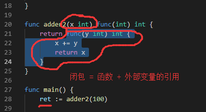
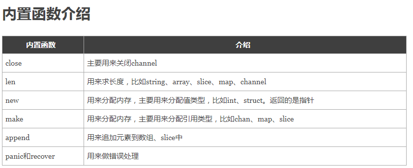

# day03课上笔记
# 【免费学习go语言资料www.5lmh.com】
如果什么都很容易，那还叫什么选择。

走上坡路肯定是会累的。

# 内容回顾

 ## 运算符

### 算术运算符

+-*/

### 逻辑运算符

`&&` `||` `!`

### 位运算符

`>>` `<<` `|` `^` `&`

### 赋值运算符

`=` `+=` 。。。

`++` 和`--` 是独立的语句，不属于赋值运算符

### 比较运算符

`<` `<=` `!=` 。。。

## 数组（Array）

`var ages [30]int`

`var names [30]string`

`var nums [40]int`

数组包含元素的类型和元素的个数。元素的个数（数组的长度）属于数组类型的一部分。

数组是值类型。

## 切片

切片的定义

切片不存值，它就像一个框，去底层数组框值。

切片：指针、长度、容量

切片的扩容策略：

	1. 如果申请的容量大于原来的2倍，那就直接扩容至新申请的容量
 	2. 如果小于1024， 那么就直接两倍
 	3. 如果大于1024，就按照1.25倍去扩容
 	4. 具体存储的值类型不同，扩容策略也有一定的不同。

append函数

## 指针

只需要记住两个符号：`&` 和`*`


## map

map存储的是键值对的数据。

也是需要申请内存的。


# 今日内容

## 函数

### 函数的定义

#### 基本格式

```go
func f1() {
	fmt.Println("Hello 沙河！")
}
```

#### 参数的格式

有参数的函数

```go
func f2(name string) {
	fmt.Println("Hello", name)
}

```

参数类型简写

```go
// 参数类型简写
func f4(x, y int) int {
	return x + y
}
```

可变参数

```go
// 可变参数
func f5(title string, y ...int) int {
	fmt.Println(y) // y是一个int类型的切片
	return 1
}

```

#### 返回值的格式

有返回值

```go
// 带参数和返回值的函数
func f3(x int, y int) int {
	sum := x + y
	return sum
}
```

多返回值

```go
// Go语言中支持多个返回值
func f7(x, y int) (sum int, sub int) {
	sum = x + y
	sub = x - y
	return
}
```

命名返回值

```go
// 命名返回值
func f6(x, y int) (sum int) {
	sum = x + y // 如果使用命名的返回值，那么在函数中可以直接使用返回值变量
	return      // 如果使用命名的返回值,return后面可以省略返回值变量
}
```


### 变量作用域

1. 全局作用域
2. 函数作用域
   1. 先在函数内部找变量，找不到往外层找
   2. 函数内部的变量，外部是访问不到的
3. 代码块作用域

```go
var x = 100 // 定义一个全局变量

// 定义一个函数
func f1() {
	// x := 10
	name := "理想"
	// 函数中查找变量的顺序
	// 1. 先在函数内部查找
	// 2. 找不到就往函数的外面查找,一直找到全局
	fmt.Println(x, name)
}

func main() {
	f1()
	// fmt.Println(name) // 函数内部定义的变脸只能在该函数内部使用

	// 语句块作用域
	if i := 10; i < 18 {
		fmt.Println("乖乖上学")
	}
	// fmt.Println(i) // 不存在i
	for j := 0; j < 5; j++ {
		fmt.Println(j)
	}
	// fmt.Println(j) // 不存在j
}
```

### 高阶函数

函数也是一种类型，它可以作为参数，也可以作为返回值。

```go
// 函数也可以作为参数的类型
func f3(x func() int) {
	ret := x()
	fmt.Println(ret)
}

func ff(a, b int) int {
	return a + b
}

// 函数还可以作为返回值
func f5(x func() int) func(int, int) int {
	return ff
}
```


### 匿名函数

没有名字的函数。

多用在函数内部定义函数时使用。

```go
func main() {

	// 函数内部没有办法声明带名字的函数
	// 匿名函数
	f1 := func(x, y int) {
		fmt.Println(x + y)
	}
	f1(10, 20)

	// 如果只是调用一次的函数，还可以简写成立即执行函数
	func(x, y int) {
		fmt.Println(x + y)
		fmt.Println("Hello world!")
	}(100, 200)
}
```

### 闭包




### defer

defer延迟调用，会把defer后面的语句延迟调用

把当时的状态都保存

defer多用于释放资源

多个defer存在时，按照先进后出的方式去执行。

```go
func calc(index string, a, b int) int {
	ret := a + b
	fmt.Println(index, a, b, ret)
	return ret
}

func main() {
	a := 1
	b := 2
	defer calc("1", a, calc("10", a, b))
	a = 0
	defer calc("2", a, calc("20", a, b))
	b = 1
}

// 1. a:=1
// 2. b:=2
// 3. defer calc("1", 1, calc("10", 1, 2))
// 4. calc("10", 1, 2) // "10" 1 2 3
// 5. defer calc("1", 1, 3)
// 6. a = 0
// 7. defer calc("2", 0, calc("20", 0, 2))
// 8. calc("20", 0, 2) // "20" 0 2 2
// 9. defer calc("2", 0, 2)
// 10. b = 1
// calc("2", 0, 2) // "2" 0 2 2
// calc("1", 1, 3) // "1" 1 3 4

// 最终的答案：
// "10" 1 2 3
// "20" 0 2 2
//  "2" 0 2 2
// "1" 0 3 3
```


### 内置函数



### panic和recover

```go
func funcA() {
	fmt.Println("a")
}

func funcB() {
	// 刚刚打开数据库连接
	defer func() {
		err := recover()
		fmt.Println(err)
		fmt.Println("释放数据库连接...")
	}()
	panic("出现了严重的错误！！！") // 程序崩溃退出
	fmt.Println("b")
}

func funcC() {
	fmt.Println("c")
}
func main() {
	funcA()
	funcB()
	funcC()
}
```

### 今天的难点

1. 函数的定义
2. 高阶函数
3. 函数类型
4. 闭包
5. defer
6. panic/revocer

# 本周作业

1. 分金币作业

   ```go
   
   /*
   你有50枚金币，需要分配给以下几个人：Matthew,Sarah,Augustus,Heidi,Emilie,Peter,Giana,Adriano,Aaron,Elizabeth。
   分配规则如下：
   a. 名字中每包含1个'e'或'E'分1枚金币
   b. 名字中每包含1个'i'或'I'分2枚金币
   c. 名字中每包含1个'o'或'O'分3枚金币
   d: 名字中每包含1个'u'或'U'分4枚金币
   
   写一个程序，计算每个用户分到多少金币，以及最后剩余多少金币？
   程序结构如下，请实现 ‘dispatchCoin’ 函数
   */
   var (
   	coins = 5000
   	users = []string{
   		"Matthew", "Sarah", "Augustus", "Heidi", "Emilie", "Peter", "Giana", "Adriano", "Aaron", "Elizabeth",
   	}
   	distribution = make(map[string]int, len(users))
   )
   
   func main() {
   	left := dispatchCoin()
   	fmt.Println("剩下：", left)
   }
   
   func dispatchCoin() (left int) {
   	// 1. 依次拿到每个人的名字
   	// 2. 拿到一个人名根据分金币的规则去分金币,
   	// 2.1 每个人分的金币数应该保存到 distribution 中
   	// 2.2 还要记录下剩余的金币数
   	// 3. 整个第2步执行完就能得到最终每个人分的金币数和剩余金币数
   	return
   }
   ```

   

2. 预习结构体[https://www.liwenzhou.com/posts/Go/10_struct/](https://www.liwenzhou.com/posts/Go/10_struct/)

