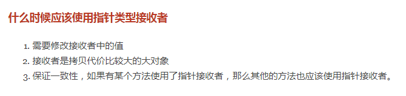

# GoS5 day04 

# 内容回顾

函数

函数的定义

```go
func 函数名(参数1, 参数2...)返回值{
    函数体
}
```


函数进阶

​	高阶函数:函数可以作为参数也可以作为返回值

​	闭包 :函数和其外部变量的引用

​	defer:延迟调用,多用于处理资源释放

​	内置函数:

​		`panic`和`recover`:

作业

​	分金币作业

补充递归函数:

1. 阶乘的例子
2. 台阶面试题

# 今日内容

结构体(struct)

### 结构体定义

```go
type 结构体名 struct{
    字段1 字段1的类型
    字段2 字段2的类型
    ...
} 
```

### 结构体初始化

#### 先声明再赋值

```go
var p person // 声明一个person类型的变量p
p.name = "元帅"
p.age = 18
fmt.Println(p)
```

#### 声明同时初始化 

键值对初始化

```go
// 键值对初始化
var p2 = person{
	name: "冠华",
	age:  15,
}
fmt.Println(p2)
```

值列表初始化

```go
// 值列表初始化
var p3 = person{
	"理想",
	100,
}
fmt.Println(p3)
```

#### 注意事项:

1. 两者不能混用

2. 没有赋值的字段会使用对应类型的零值.

### 结构体指针

结构体是值类型,赋值的时候都是拷贝.

当结构体字段较多的时候,为了减少内存消耗可以传递结构体指针.

### 构造函数

返回一个结构体变量的函数,为了实例化结构体的时候更省事儿.

```go
func newPerson(name string, age int)person{
    return person{
        name: name,
        age: age,
    }
}
```

### 方法

方法是作用于特定类型的函数.

方法的定义:(万变不离其宗)

```go
func (接收者变量 接收者类型)方法名(参数)返回值{
    // 方法体
}
```

#### 接收者

接收者通常使用类型首字母的小写,不建议使用诸如`this`和`self`这样的.

### 值接收者和指针接收者的区别

使用值接收者的方法不能修改结构体变量

使用指针接收者的方法可以修改结构体的变量,课上过年长一岁的例子.



我们应该尽量使用指针接收者.

### 标识符

// 标识符:变量名 函数名 类型名 方法名

// Go语言中如果标识符首字母是大写的,就表示对外部包可见(暴露的,公有的).

### 匿名字段

没有名字的字段.

### 嵌套结构体

```go
type address struct {
	province string
	city     string
}

type company struct {
	name string
	addr address // 嵌套
}

```

### 匿名嵌套结构体

```go
type address struct {
	province string
	city     string
}

type company struct {
	name string
	address // 嵌套匿名结构体
}
```


### 匿名嵌套结构体的字段冲突

先在自己结构体找这个字段,找不到就去匿名嵌套的结构体中查找该字段

```go
type address struct {
	province string
	city     string
}

type workPlace struct {
	province string
	city     string
}

type person struct {
	name    string
	age     int
	address   // 匿名嵌套结构体
	workPlace // 匿名嵌套结构体
}
```

## 结构体与JSON

JSON:是一种跨语言的数据格式.多用于在不同语言间传递数据

```go
// 1.序列化:   把Go语言中的结构体变量 --> json格式的字符串
// 2.反序列化: json格式的字符串   --> Go语言中能够识别的结构体变量

type person struct {
	Name string `json:"name" db:"name" ini:"name"`
	Age  int    `json:"age"`
}

func main() {
	p1 := person{
		Name: "周林",
		Age:  9000,
	}
	// 序列化
	b, err := json.Marshal(p1)
	if err != nil {
		fmt.Printf("marshal failed, err:%v", err)
		return
	}
	fmt.Printf("%v\n", string(b))
	// 反序列化
	str := `{"name":"理想","age":18}`
	var p2 person
	json.Unmarshal([]byte(str), &p2) // 传指针是为了能在json.Unmarshal内部修改p2的值
	fmt.Printf("%#v\n", p2)
}
```

# 作业

1. 把课上写的代码都自己敲一遍
2. 把课上写的函数版学生信息管理系统自己写一遍
3. 把函数版学员信息管理系统改写成方法版.(提示:谁的方法)