# day05课上笔记

# 内容回顾

### 自定义类型和类型别名

```go
type MyInt int // 自定义类型
type newInt = int // 类型别名
```

类型别名只在代码编写 过程中有效,编译完之后就不存在,内置的`byte`和`rune`都属于类型别名.

## 结构体

基本的数据类型:表示现实中的物件有局限性.

编程是代码解决现实生活中的问题.

```go
var name = "保德路"
```

结构体是一种数据类型,一种我们自己造的可以保存多个维度数据的类型.

```go
type person struct {
    name string
    age int
   	id int64
    addr string
}
```

匿名结构体

多用于临时场景.

```go
var a = struct{
    x int
    y int
}
```

结构体的初始化

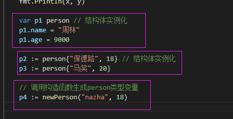

构造函数

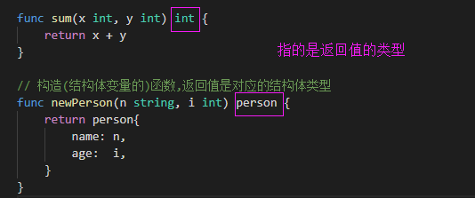

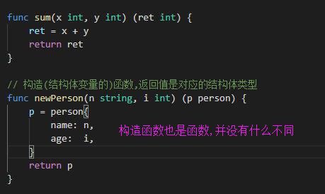


### 方法和接收者

方法是有接收者的函数,接收者指的是哪个类型的变量可以调用这个函数.

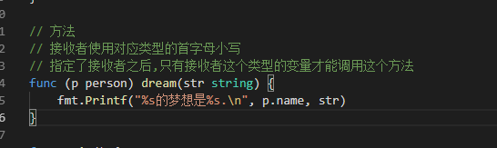


结构体是值类型,

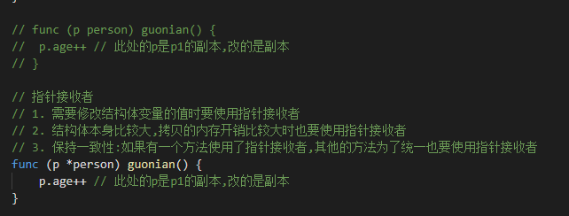


结构体的嵌套

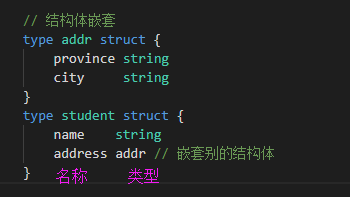


结构体的匿名字段

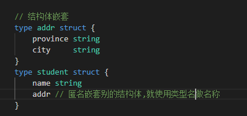

### JSON序列化与反序列化

经常出现问题:

1. 架构体内部的字段首字母要大写!!!不大写别人是访问不到
2. 反序列化时要传递指针!

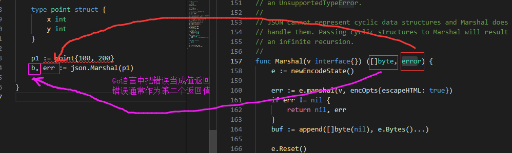

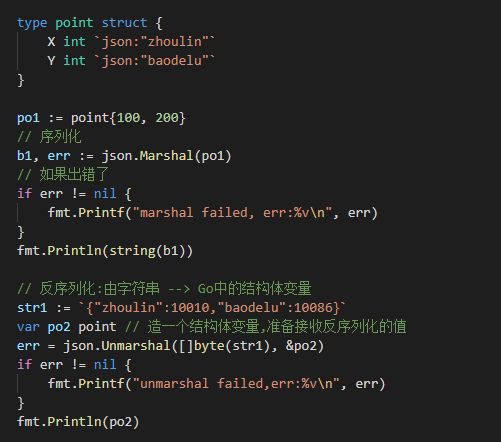

# 今日内容

## 接口(interface) 

[博客:https://www.liwenzhou.com/posts/Go/12_interface/](https://www.liwenzhou.com/posts/Go/12_interface/)

接口是一种类型,是一种特殊的类型,它规定了变量有哪些方法.

在编程中会遇到以下场景:

我不关心一个变量是什么类型,我只关心能调用它的什么方法.

### 接口的定义

```go
type 接口名 interface {
    方法名1(参数1,参数2...)(返回值1, 返回值2...)
    方法名2(参数1,参数2...)(返回值1, 返回值2...)
    ...
}
```

用来给变量\参数\返回值等设置类型.

### 接口的实现

一个变量如果实现了接口中规定的所有的方法,那么这个变量就实现了这个接口,可以称为这个接口类型的变量.

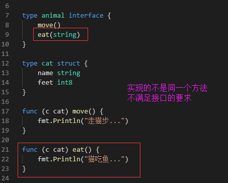


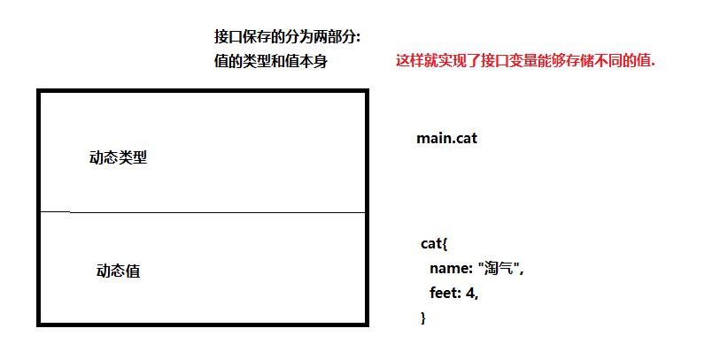

### 使用值接收者实现接口与使用指针接收者实现接口的区别?

使用值接收者实现接口,结构体类型和结构体指针类型的变量都能存.

指针接收者实现接口只能存结构体指针类型的变量.

### 接口和类型的关系

多个类型可以实现同一个接口.

一个类型可以实现多个接口.

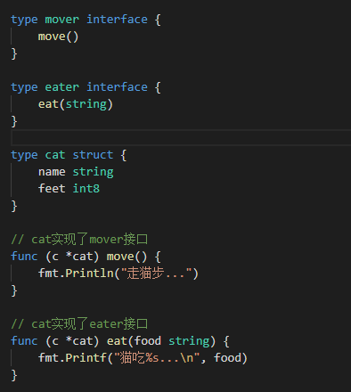

### 接口可以嵌套

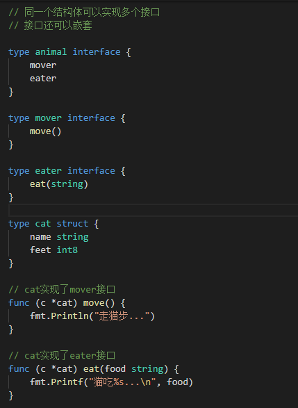


### 空接口

没有必要起名字,通常定义成下面的格式:

```go
interface{} // 空接口
```

所有的类型都实现了空接口.也就是任意类型的变量都能保存到空接口中.

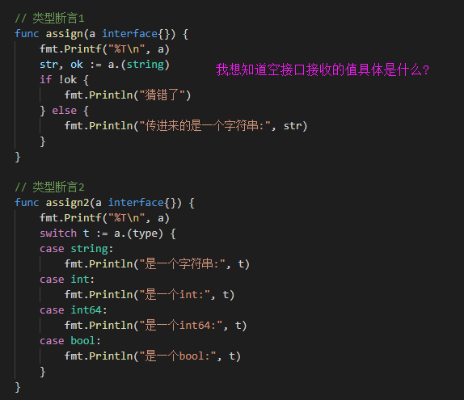


## 包(package)

[博客:https://www.liwenzhou.com/posts/Go/11_package/](https://www.liwenzhou.com/posts/Go/11_package/)

* 包的路径从`GOPATH/src`后面的路径开始写起,路径分隔符用`/`
* 想被别的包调用的标识符都要首字母大写!
* 单行导入和多行导入
* 导入包的时候可以指定别名
* 导入包不想使用包内部的标识符,需要使用匿名导入
* 每个包导入的时候会自动执行一个名为`init()`的函数,它没有参数也没有返回值也不能手动调用
* 多个包中都定义了`init()`函数,则它们的执行顺序见下图:

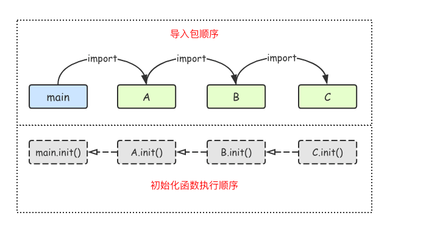

## 文件操作

[博客:https://www.liwenzhou.com/posts/Go/go_file/](https://www.liwenzhou.com/posts/Go/go_file/)

```go
package main

import (
        "fmt"
        "os"
)

// 打开文件

func main() {
        fileObj, err := os.Open("./main.go")
        if err !
读了128个字节
= nil {
                fmt.Printf("open file failed, err:%v", err)
                return
        }
        // 记得关闭文件
        defer fileObj.Close()
        // 读文
读了128个字节
件
        // var tmp = make([]byte, 128) // 指定读的长度
        var tmp [128]byte
        for {
                n, err := fileObj.Read(tmp[:])
                if e
读了128个字节
rr != nil {
                        fmt.Printf("read from file failed, err:%v", err)
                        return
                }
                fmt.Printf("读了%d个字节\n", n)
                fmt.
读了66个字节
Println(string(tmp[:n]))
                if n == 0 {
                        return
                }
        }

}
```

# 作业

1. 把课上读文件的3种方式写一遍
2. 把课上写文件的3种方式和copyFIle那个函数写一遍
3. 日志库

自己写一个日志库.

接口: 用处?日志可以输出到终端,也可以输出到文件,输出到kafka

需求:

1. 可以往不同的输出位置记录日志
2. 日志分为五种级别
