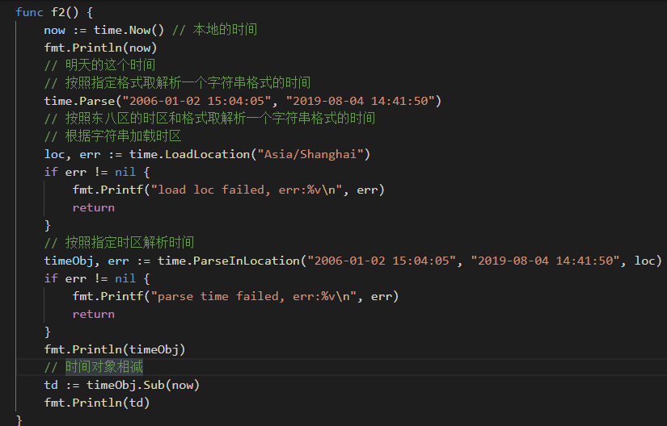

# day06课上笔记

# 内容回顾

## 包

包的定义 -->`package`关键字,包名通常是和目录名一致,不能包含`-`

* 一个文件夹就是一个包
* 文件夹里面放的都是`.go`文件

包的导入 --> `import`

* 包导入路径是从`$GOPATH/src`后面的路径开始写起

	* 单行导入
	* 多行导入
	* 给导入的包起别名
	* 匿名导入 --> `sql`包导入时会讲这个
	* Go不支持循环导入

包中`标识符`(变量名\函数名\结构体名\接口名\常量...)可见性  --> 标识符首字母大写表示对外可见

`init()`

* 包导入的时候会自动执行
* 一个包里面只有一个init()
* init()没有参数也没有返回值也不能调用它
* 多个包的`init`执行顺序
* 一般用于做一些初始化操作...

## 接口

接口是一种类型,一种抽象的类型.

接口就是你要实现的方法的清单.

接口的定义

```go
type mover interface {
    方法的签名(参数)(返回值)
}
```

### 接口的实现

实现了接口的所有方法就实现了这个接口.

实现了接口就可以当成这个接口类型的变量

### 接口变量

实现了一个变量,可以保存所有实现了我这个接口的类型的值.

### 空接口

`interface{}`:空接口

接口中没有定义任何方法,也就是说任意类型都实现了空接口.-->任何类星斗可以存到空接口变量中

* 作为函数参数 --> `fmt.Println()`

* `map[string]interface{}`

### 接口底层

* 动态类型
* 动态值

### 类型断言

做类型断言的前提是一定要是一个接口类型的变量.

`x.(T)`

使用`switch`来做类型断言


## 文件操作

### 打开文件和关闭文件


### 读文件

fileObj.read()

bufio

ioutil

### 写文件

`os.OpenFile()`

`fileObj.Write/filwObj.WriteString`

bufio

ioutil

# 今日内容

## time标准库

### 时间类型 time.Time

```go
now := time.Now()
fmt.Println(now)
fmt.Println(now.Year())
fmt.Println(now.Month())
fmt.Println(now.Day())
fmt.Println(now.Date())
fmt.Println(now.Hour())
fmt.Println(now.Minute())
fmt.Println(now.Second())
```

### 时间戳

```go
// 时间戳
fmt.Println(now.Unix())
fmt.Println(now.UnixNano())
// time.Unix()
ret := time.Unix(1564803667, 0)
fmt.Println(ret)
fmt.Println(ret.Year())
fmt.Println(ret.Day())
```

### 时间间隔

```go
// 时间间隔
fmt.Println(time.Second)
// now + 24小时
fmt.Println(now.Add(24 * time.Hour))
```

### 定时器

```go
timer := time.Tick(time.Second)
for t := range timer {
	fmt.Println(t) // 1秒钟执行一次
}
```

### 格式化时间

```go
// 格式化时间 把语言中时间对象 转换成字符串类型的时间
// 2019-08-03
fmt.Println(now.Format("2006-01-02"))
// 2019/02/03 11:55:02
fmt.Println(now.Format("2006/01/02 15:04:05"))
// 2019/02/03 11:55:02 AM
fmt.Println(now.Format("2006/01/02 03:04:05 PM"))
// // 2019/02/03 11:55:02.342
fmt.Println(now.Format("2006/01/02 15:04:05.000"))
// 按照对应的格式解析字符串类型的时间
timeObj, err := time.Parse("2006-01-02", "2019-08-03")
if err != nil {
	fmt.Printf("parse time failed, err:%v\n", err)
	return
}
fmt.Println(timeObj)
fmt.Println(timeObj.Unix())
```




## 日志库

### 需求分析

1. 支持往不同的地方输出日志
2. 日志分级别
   1. Debug
   2. Trace
   3. Info
   4. Warning
   5. Error
   6. Fatal

3. 日志要支持开关控制，比如说开发的时候什么级别都能输出，但是上线之后只有INFO级别往下的才能输出
4. 完整的日志记录要包含有时间、行号、文件名、日志级别、日志信息
5. 日志文件要切割
   1. 按文件大小切割 
      1. 每次记录日志之前都判断一下当前写的这个文件的文件大小
   2. 按日期切割
      1. 在日志结构体中设置一个字段记录上一次切割的小时数
      2. 在写日志之前检查一下当前时间的小时数和之前保存的是否一致，不一致就要切割

### 反射

**反射只需要了解原理即可，不必过分纠结于此**

#### 反射的应用

`json`反序列化就是反射的应用。

`{"name:"zhoulin", "age":9000}`

```go
type person struct {
    Name string ``
}
```

### 反射的两个方法

`reflect.TypeOf`和`reflect.ValueOf`

type又分为`Name()`,`Kind()`

```go
package main

import (
	"fmt"
	"reflect"
)

type Cat struct {
}

func reflectType(x interface{}) {
	v := reflect.TypeOf(x)
	fmt.Printf("type:%v\n", v)
	fmt.Printf("type name:%v type kind:%v\n", v.Name(), v.Kind())
}

func reflectValue(x interface{}) {
	v := reflect.ValueOf(x)
	k := v.Kind() // 值的类型种类
	switch k {
	case reflect.Int64:
		// v.Int()从反射中获取整型的原始值，然后通过int64()强制类型转换
		fmt.Printf("type is int64, value is %d\n", int64(v.Int()))
	case reflect.Float32:
		// v.Float()从反射中获取整型的原始值，然后通过float32()强制类型转换
		fmt.Printf("type is float32, value is %f\n", float32(v.Float()))
	case reflect.Float64:
		// v.Float()从反射中获取整型的原始值，然后通过float64()强制类型转换
		fmt.Printf("type is float64, value is %f\n", float64(v.Float()))
	}
}

// 通过反射设置变量的值
func reflectSetValue1(x interface{}) {
	v := reflect.ValueOf(x)
	if v.Kind() == reflect.Int64 {
		v.SetInt(200) //修改的是副本，reflect包会引发panic
	}
}

func reflectSetValue2(x interface{}) {
	v := reflect.ValueOf(x)
	if v.Elem().Kind() == reflect.Int64 {
		v.Elem().SetInt(200) //修改的是副本，reflect包会引发panic
	}
}

func main() {
	var a float32 = 3.14
	reflectType(a) // type:float32
	var b int64 = 100
	reflectType(b) // type:int64
	var c = Cat{}
	reflectType(c)
	// ValueOf
	reflectValue(a)
	// 设置值
	// reflectSetValue1(&b)
	reflectSetValue2(&b)
	fmt.Println(b)
}
```

### 结构体反射

```go
package main

import (
	"fmt"
	"reflect"
)

type student struct {
	Name  string `json:"name" zhoulin:"嘿嘿嘿"`
	Score int    `json:"score" zhoulin:"哈哈哈"`
}

func main() {
	stu1 := student{
		Name:  "小王子",
		Score: 90,
	}

	t := reflect.TypeOf(stu1)

	fmt.Println(t.Name(), t.Kind()) // student struct

	// 通过for循环遍历结构体的所有字段信息
	fmt.Println(t.NumField()) // 2
	for i := 0; i < t.NumField(); i++ {
		field := t.Field(i)
		fmt.Printf("name:%s index:%d type:%v json tag:%v\n", field.Name, field.Index, field.Type, field.Tag.Get("zhoulin"))
	}

	// 通过字段名获取指定结构体字段信息
	if scoreField, ok := t.FieldByName("Score"); ok {
		fmt.Printf("name:%s index:%d type:%v json tag:%v\n", scoreField.Name, scoreField.Index, scoreField.Type, scoreField.Tag.Get("json"))
	}
}
```

# 本周分享

要学会`舔人`. 

只要思想不滑坡，方法总比困难多。

饲养员竟然让老母猪笑话着了。

`学历`尽量补齐自己的短板！

# 本周作业

1. 把课上写的日志库自己独立写完。
2. 附加题：利用反射实现一个ini配置文件解析