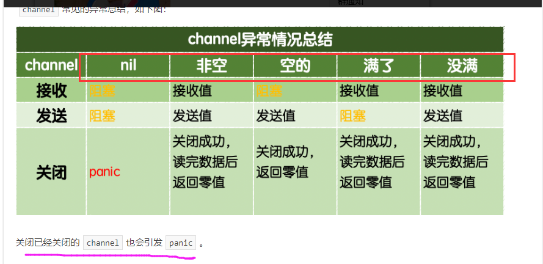

# day07课上笔记

# 内容回顾

## time

`2006-01-02 15:04:05.000`

### 时间类型

* `time.Time`  : `time.Now()`
* 时间戳：
  * `time.Now().Unix()` ：1970.1.1到现在的秒数
  * `time.Now().UnixNano()` :1970.1.1到现在的纳秒数

### 时间间隔类型

* `time.Duration`:  时间间隔类型，
  * `time.Second`

```go
const (
	Nanosecond  Duration = 1
	Microsecond          = 1000 * Nanosecond
	Millisecond          = 1000 * Microsecond
	Second               = 1000 * Millisecond
	Minute               = 60 * Second
	Hour                 = 60 * Minute
)
```

## 时间操作

时间对象+/-一个时间间隔对象

```go
// now + 24小时
fmt.Println(now.Add(24 * time.Hour))
// Sub 两个时间相减
nextYear, err := time.Parse("2006-01-02 15:04:05", "2019-08-04 12:25:00")
if err != nil {
	fmt.Printf("parse time failed, err:%v\n", err)
	return
}
now = now.UTC()
d := nextYear.Sub(now)
```

after/before

### 时间格式化

2006-01-02 15:04:05.000

### 定时器

```go
timer := time.Tick(time.Second)
for t := range timer {
	fmt.Println(t) // 1秒钟执行一次
}
```

### 解析字符串格式的时间(时区)

```go
// 按照指定格式取解析一个字符串格式的时间
time.Parse("2006-01-02 15:04:05", "2019-08-04 14:41:50")
// 按照东八区的时区和格式取解析一个字符串格式的时间
// 根据字符串加载时区
loc, err := time.LoadLocation("Asia/Shanghai")
if err != nil {
	fmt.Printf("load loc failed, err:%v\n", err)
	return
}
// 按照指定时区解析时间
timeObj, err := time.ParseInLocation("2006-01-02 15:04:05", "2019-08-04 14:41:50", loc)
if err != nil {
	fmt.Printf("parse time failed, err:%v\n", err)
	return
}
fmt.Println(timeObj)
```

## 日志库

time

文件操作

`runtime.Caller()`

之前学的内容的整合

## 反射

接口类型的变量底层是分为两部分:动态类型和动态值.

反射的应用:`json`等数据解析\ORM等工具...

### 反射的两个方法:

* `reflect.TypeOf()`
* `reflect.ValueOf()`

## ini解析作业

了解原理为主。

详见今日课上代码`ini_demo`

# 今日内容

## strconv标准库


## 并发

记住并发和并行的区别

## goroutine

`goroutine`是用户态的线程，比内核态线程更轻量级，是由Go语言的运行时(runtime)调度的。

### 启动goroutine

```go
// goroutine

func hello(i int) {
	fmt.Println("hello", i)
}

// 程序启动之后会创建一个主goroutine去执行
func main() {
	for i := 0; i < 100; i++ {
		go hello(i) // 开启一个单独的goroutine去执行hello函数（任务）
	}
	fmt.Println("main")
	time.Sleep(time.Second)
	// main函数结束了 由main函数启动的goroutine也都结束了
}
```

### `goroutine`什么结束?

goroutine 对应的函数结束了，goroutine结束了。

`main`函数执行完了，由`main`函数创建的那些`goroutine`都结束了。

### math/rand

```go
func f() {
	rand.Seed(time.Now().UnixNano()) // 保证每次执行的时候都有点不一样
	for i := 0; i < 5; i++ {
		r1 := rand.Int()    // int64
		r2 := rand.Intn(10) // 0<= x < 10
		fmt.Println(r1, r2)
	}
}
```

### `goroutine`调度模型

`GMP`

`M:N`:把m个goroutine分配给n个操作系统线程去执行.

goroutine初始栈的大小是2k.


## channel

```go
var b chan int // 需要指定通道中元素的类型
```

**通道必须使用make函数初始化才能使用!!!**

### 通道的操作

 `<-` 

1. 发送 : `ch1 <- 1`
2. 接收: ` <- ch1`
3. 关闭:`close()`

### 带缓冲的通道和无缓冲的通道

无缓冲的通道要想发送值，必须有人接收。--》4x100接力传接棒


### 单向通道

多用于函数传参，限制函数中通道的操作。


### work pool

`goroutine`池



### select多路复用


# 作业

1. 为了保证业务代码的执行性能将之前写的日志库改写为异步记录日志方式。

   业务代码记日志先存放到通道中，然后起一个后台goroutine专门从通道中取日志网文件里写。

   1. 日志库中channel怎么用？
   2. 什么时候起后台的goroutine去写日志到文件中

