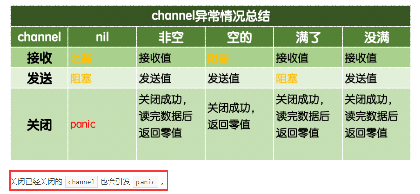
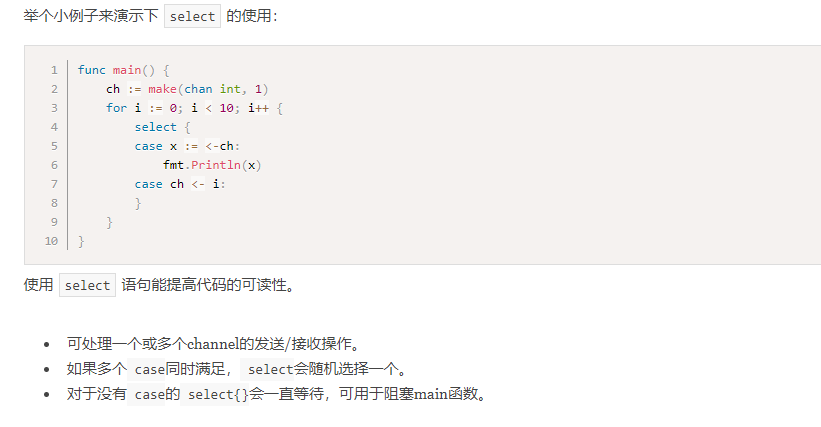

# day08课上笔记

# 内容回顾

## 并发之goroutine

### 并发和并行的区别

### goroutine的启动

将要并发执行的任务包装成一个函数，调用函数的时候前面加上`go`关键字，就能够开启一个goroutine去执行该函数的任务。

goroutine对应的函数执行完，该goroutine就结束了。

程序启动的时候会自动的创建一个goroutine去执行main函数

main函数结束了，那么程序就结束了，由该程序启动的所有其他goroutine也都结束了。

### goroutine的本质

goroutine的调度模型：`GMP`

`M:N`：把m个goroutine分配给n个操作系统线程。

### goroutine与操作系统线程（OS线程）的区别

goroutine是用户态的线程，比内核态的线程更轻量级一点，初始时只占用2KB的栈空间。

可以轻松开启数十万的goroutine也不会崩内存。

### runtime.GOMAXPROCS

Go1.5之后默认就是操作系统的逻辑核心数，默认跑满CPU

`runtime.GOMAXPROCS(1)`:只占用一个核。

### work pool模式

开启一定数据的goroutine去干活。


### sync.WaitGroup

`var wg sync.WaitGroup`

* wg.Add(1)  ：计数器+1
* wg.Done()：计数器-1
* wg.Wait()：等

## channel

### 为什么需要channel?

通过channel实现多个goroutine之间的通信。

`CSP`:通过通信来共享内存。


channel是一种类型，一种引用类型。make函数初始化之后才能使用。（slice、map、channel）


### channel的声明

`var ch chan 元素类型`

### channel的初始化

`ch = make(chan 元素类型, [缓冲区大小])`

### channel的操作

* 发送：`ch <- 100`
* 接收：`x := <- ch`
* 关闭: `close(ch)`

### 带缓冲区的通道和无缓冲区的通道：

快递员送快递的示例，有缓冲区就是有快递柜。


### 从通道中取值：

```go
for {
	x, ok := <-results
	if !ok { // 什么时候ok=false? results被关闭的时候
		break
	}
	fmt.Println(x)
}

for x := range results {
	fmt.Println(x)
}
```

### 单项通道：

通常是用做函数的参数，只读通道`<-chan int`和只写通道`chan<- int`


### 通道的各种考虑情况：




## select

同一时刻有多个通道要操作的场景下，使用select。



# 今日内容

## sync包

### sync.Mutex 互斥锁

适用于并发访问公共资源的场景。

声明互斥锁

```go
var lock sync.Mutex
```

使用互斥锁

```go
func add() {
	for i := 0; i < 500000; i++ {
		lock.Lock()
		x = x + 1
		lock.Unlock()
	}
	wg.Done()
}
```


### sync.RWMutex 读写互斥锁

适用于读远远大于写的场景。

声明读写互斥锁

```go
var rwLock sync.RWMutex
```

使用读写互斥锁

```go
// 读操作
func read() {
	defer wg.Done()
	rwLock.RLock()
	fmt.Println(x)
	time.Sleep(time.Millisecond * 2)
	rwLock.RUnlock()
}

// 写操作
func write() {
	defer wg.Done()
	rwLock.Lock()
	x = x + 1
	time.Sleep(time.Millisecond * 10)
	rwLock.Unlock()
}
```


### sync.Once 

适用于那些只执行一次的场景。

例如，只加载一次图片、只关闭一次channel

### sync.Map

Go内置的map不是并发安全的。

```go
// sync.Map 是一个开箱即用的并发安全的map

var m2 = sync.Map{}

func main() {
	wg := sync.WaitGroup{}
	for i := 0; i < 21; i++ {
		wg.Add(1)
		go func(n int) {
			key := strconv.Itoa(n)
			m2.Store(key, n)         // 必须使用sync.Map内置的Store方法设置键值对
			value, _ := m2.Load(key) // 必须使用sync.Map提供的Load方法根据key取值
			fmt.Printf("k=:%v,v:=%v\n", key, value)
			wg.Done()
		}(i)
	}
	wg.Wait()
}
```

### atomic


### 网络编程


### 互联网协议


### TCP客户端和服务端


### TCP黏包


### UDP客户端和服务端


引申知识点:

[大端和小端](<https://zhuanlan.zhihu.com/p/36149865>)


# 作业

1. 写一个支持多客户端聊天的人工智能TCP的服务
   1. 把?换成!
   2. 把你换成我
   3. 把吗去掉

问:你是机器人吗?

回:我是机器人
