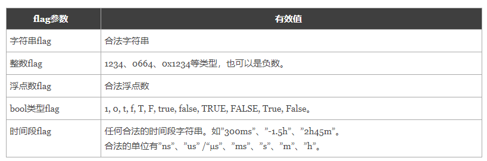
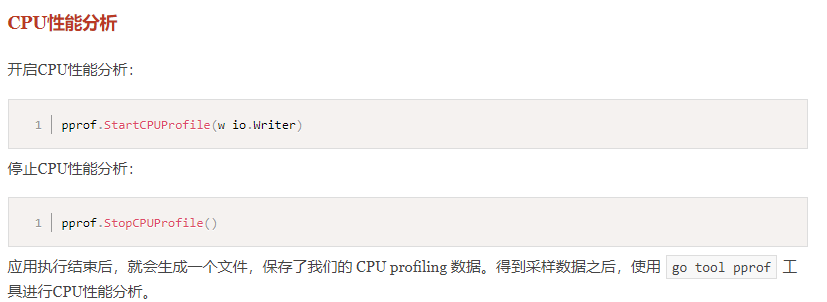
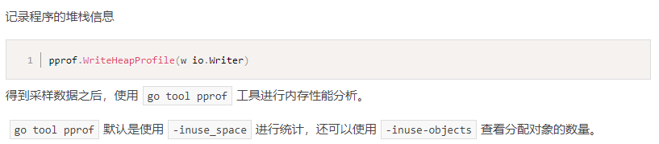

# day09课上笔记


# 今日分享

注释\日志\单元测试

要做就做专业的,从一开始就规范起来.

《无声告白》

# 内容回顾

## 互斥锁

`sync.Mutex`

是一个结构体.是值类型.给函数传参数的时候要传指针.

### 两个方法

```go
var lock sync.Mutex
lock.Lock() // 加锁
lock.Unlock() // 解锁
```

### 为什么要用锁?

防止同一时刻多个goroutine操作同一个资源.

## 读写互斥锁

### 应用场景

适用于读多写少的场景下,才能提高程序的执行效率.

### 特点

1. 读的goroutine来了获取的是**读锁**,后续的goroutine能读不能写
2. 写的goroutine来了获取的是**写锁**,后续的goroutine不管是读还是写都要等待获取锁

### 使用

```go
var rwLock sync.RWMutex
rwLock.RLock() // 获取读锁
rwLock.RUnlock() // 释放读写

rwLock.Lock() // 获取写锁
rwLock.Unlock() // 释放写锁
```

## 等待组

`sync.Waitgroup`

用来等groutine执行完再继续

是一个结构体.是值类型.给函数传参数的时候要传指针.

### 使用

```go
var wg sync.WaitGroup

wg.Add(1) // 起几个goroutine就加几个计数
wg.Done() // 在goroutine对应的函数中,函数要结束的时候表示goroutine完成,计数器-1
wg.Wait() // 阻塞,等待所有的goroutine都结束
```

## Sync.Once

### 使用场景

某些函数只需要执行一次的时候,就可以使用`sync.Once`

比如 blog加载图片那个例子

```go
var once sync.Once

once.Do() // 接受一个没有参数也没有返回值的函数,如有需要可以使用闭包
```

### sync.Map

### 使用场景

并发操作一个map的时候,内置的map不是并发安全的.

### 使用

是一个开箱即用(不需要make初始化)的并发安全的map,

```go
var syncMap sync.Map

// Map[key] = value // 原生map
syncMap.Store(key, value)
syncMap.Load(key)
syncMap.LoadOrStore()
syncMap.Delete()
syncMap.Range()
```

## 原子操作

Go语言内置了一些针对内置的基本数据类型的一些并发安全的操作

```go
var i int64 = 10
atomic.AddInt64(&i, 1)
```

## 网络编程

### 互联网的协议

OSI七层模型


HTTP:超文本传输协议. 
**裸体的人**

规定了:浏览器和网站服务器之间通信的规则.

HTML:超文本标记语言 

学的就是标记的符号,标签

CSS:层叠样式表

**让人穿上衣服/化妆**

规定了HTML中标签的具体样式(颜色\背景\大小\位置\浮动\...)

JavaScript:一种跑在浏览器上的编程语言.

**让人动起来**


## HTTP Client

GET请求带参数

共用client

disableKeepAlive的client

# 今日内容

## 单元测试

开发自己给自己的代码写测试。

测试函数覆盖率：100%

测试覆盖率：60%

测试文件要以`**_test.go`结尾

单元测试函数要以

```go
func TestXxx(t *testing.T){}
```

## 性能基准测试

性能基准测试

```go
// BenchmarkSplit 基准测试
func BenchmarkSplit(b *testing.B) {
	for i := 0; i < b.N; i++ {
		Split("a:b:c", ":")
	}
}
```

性能比较函数

```go
// 性能比较测试
func benchmarkFib(b *testing.B, n int) {
	for i := 0; i < b.N; i++ {
		Fib(n)
	}
}

func BenchmarkFib1(b *testing.B) {
	benchmarkFib(b, 1)
}
```

## flag

命令行标志位参数的使用, [博客地址](<https://www.liwenzhou.com/posts/Go/go_flag/>)

### 支持的参数类型



### 两种方式

```go
name := flag.String("name", "默认值", "帮助信息") // 注意返回的name是指针类型
```


```go
var name string
flag.StringVar(&name, "name", "默认值", "帮助信息") // 注意传指针
```

### 必须flag.Parse()

必须调用`flag.Parse()`参数才能从命令行解析到具体的参数.

### 其他参数相关

```go
flag.Args()  ////返回命令行参数后的其他参数，以[]string类型
flag.NArg()  //返回命令行参数后的其他参数个数
flag.NFlag() //返回使用的命令行参数个数
```

## pprof调试工具

### CPU维度的profile数据：



### 内存维度的profile数据：



### 进行分析

```go
go tool pprof profile输出的文件
```

常用命令:

```bash
(pprof) top 3 // 查看前3占用CPU高的函数
```

```bash
(pprof) list 函数名 // 查看函数名详细数据
```

```bash
(pprof) web // 使用浏览器查看svg图,需要先安装 graphviz 工具
```

火焰图

# 每周任务

1. 下课回去的路上用手机的备忘录概括(总结)一下当天的内容.
   1. 先列梗概(目录/大纲)
   2. 再去逐一(一个一个的)填充重点内容
   3. 写完往微信的小组群里一发,自豪感就油然而生.
2. 小组微信群组团讨论作业需求和写作业
3. 编写一个回文检测函数，并为其编写单元测试和基准测试，根据测试的结果逐步对其进行优化。（回文：一个字符串正序和逆序一样，如“Madam,I’mAdam”、“油灯少灯油”等。）
4. 下周来之前把MySQL、Redis 环境都准备好!

