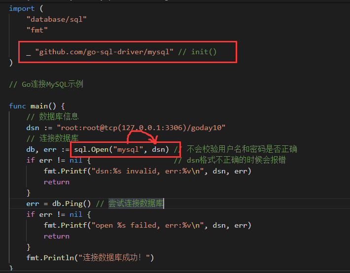
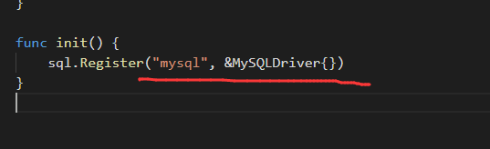

# day10课上笔记


# 本周分享

两个面试题

[leetcode刷题，每天一道题强壮程序员](https://leetcode-cn.com/problems/two-sum/)

数据结构和算法很重要，要找机会抓紧补上。

# 内容回顾

## net/http包的用法

如何发请求

当需要频繁发送请求的时候（每5秒从阿里云同步接口数据）：定义一个全局的client，后续发请求的操作都使用这个全局的client

## 单元测试

### 单元测试

xxx/ccc.go 

单元测试文件名必须是`xxx/ccc_test.go`

go内置的测试工具：

```bash
go test 
```

单元测试函数的格式：

```go
import "testing"
// Test开头后接函数名
func TestSplit(t *testing.T){
    t.Fatal()
}
```

### 性能测试/基准测试

函数格式：

```
func BenchmarkSplit(b *testing.B){
	// b.N：被测试函数执行的次数
}
```

执行命令：

```go
go test -bench -v
```

并行测试

### setup和teardown

## pprof

记录CPU快照信息

记录内存的快照信息

[pprof博客](<https://www.liwenzhou.com/posts/Go/performance_optimisation/>)

## flag

### os.Args

```bash
./xxx a b c
```

osArgs:["./xxx" "a" "b" "c"]

### flag标准库

#### 声明变量

```bash
./xxx -name="周琳" -age=9000 a b c
```

两种方法：

```go
nameVal1 := flag.String("name", "卢明辉", "请输入dsb的名字") // 返回的是指针变量

var nameVal2 string
flag.StringVar(&nameVal2, "name", "卢明辉", "请输入dsb的名字") // 把一个已经存在的变量绑定到命令行flag参数
```

必须要调用：

```go
flag.Parse() // 解析命令传入的参数，赋值给对应的变量
```

其他方法：

```go
flag.Args()  ////返回命令行参数后的其他参数，以[]string类型
flag.NArg()  //返回命令行参数后的其他参数个数
flag.NFlag() //返回使用的命令行参数个数
```

# 今日内容

## MySQL

### 数据库

常见的数据库SQLlite、MySQL、SQLServer、postgreSQL、Oracle.

MySQL主流的关系型数据库，类似的还有`postgreSQL`。

关系型数据库：

用表来存一类数据。

表结构设计的三大范式：《漫画数据库》

### MySQL知识点

#### SQL语句

DDL：操作数据库的

DML：表的增删改查

DCL：用户及权限

#### 存储引擎

MySQL支持插件式的存储引擎。

常见的存储引擎：MyISAM和InnoDB。

MyISAM：

1. 查询速度快
2. 只支持表锁
3. 不支持事务

InnoDB：

1. 整体速度快
2. 支持表锁和行锁
3. 支持事务

事务：

把多个SQL操作当成一个整体。

事务的特点：

ACID：

1. 原子性：事务要么成功要么失败，没有中间状态。
2. 一致性：数据库的完整性没有被破坏
3. 隔离性：事务之间是互相隔离的。
   1. 隔离的四个级别
4. 持久性：事务操作的结果是不会丢失的。

索引：

索引的原理是啥：B树和B+树

索引的类型

索引的命中

分库分表

SQL注入

SQL慢查询优化

MySQL主从：

​	binlog

MySQL读写分离

### Go操作MySQL

#### database/sql

原生支持连接池，是并发安全的。

这个标准库没有具体的实现，只是列出了一些需要第三方库实现的具体内容。

#### 下载驱动

```go
go get -u github.com/go-sql-driver/mysql
```

`go get 包的路径`就是下载第三方的依赖。

将第三方的依赖默认保存在`$GOPATH/src/`

#### 使用驱动

```go
import (
	"database/sql"

    _ "github.com/go-sql-driver/mysql" // init()
)
```

注册驱动的原理：





#### 配置连接数

```go
db.SetMaxOpenConns(10) // 设置数据库连接池的最大连接数
db.SetMaxIdleConns(5)  // 设置最大空闲连接数
```

#### 查询单条记录

```go
// 查询单个记录
func queryOne(id int) {
	var u1 user
	// 1. 写查询单条记录的sql语句
	sqlStr := `select id, name, age from user where id=?;`
	// 2. 执行并拿到结果
	// 必须对rowObj对象调用Scan方法,因为该方法会释放数据库链接 // 从连接池里拿一个连接出来去数据库查询单条记录
	db.QueryRow(sqlStr, id).Scan(&u1.id, &u1.name, &u1.age)
	// 打印结果
	fmt.Printf("u1:%#v\n", u1)
}
```

#### 查询多条记录

```go
// 查询多条
func queryMore(n int) {
	// 1. SQL语句
	sqlStr := `select id, name, age from user where id > ?;`
	// 2. 执行
	rows, err := db.Query(sqlStr, n)
	if err != nil {
		fmt.Printf("exec %s query failed, err:%v\n", sqlStr, err)
		return
	}
	// 3. 一定要关闭rows
	defer rows.Close()
	// 4. 循环取值
	for rows.Next() {
		var u1 user
		err := rows.Scan(&u1.id, &u1.name, &u1.age)
		if err != nil {
			fmt.Printf("scan failed,err:%v\n", err)
		}
		fmt.Printf("u1:%#v\n", u1)
	}
}
```

#### 插入

```go
// 插入数据
func insert() {
	// 1. 写SQL语句
	sqlStr := `insert into user(name, age) values("图朝阳", 28)`
	// 2. exec
	ret, err := db.Exec(sqlStr)
	if err != nil {
		fmt.Printf("insert failed, err:%v\n", err)
		return
	}
	// 如果是插入数据的操作，能够拿到插入数据的id
	id, err := ret.LastInsertId()
	if err != nil {
		fmt.Printf("get id failed,err:%v\n", err)
		return
	}
	fmt.Println("id:", id)
}
```


#### 更新

```go
// 更新操作
func updateRow(newAge int, id int) {
	sqlStr := `update user set age=? where id > ?`
	ret, err := db.Exec(sqlStr, newAge, id)
	if err != nil {
		fmt.Printf("update failed, err:%v\n", err)
		return
	}
	n, err := ret.RowsAffected()
	if err != nil {
		fmt.Printf("get id failed,err:%v\n", err)
		return
	}
	fmt.Printf("更新了%d行数据\n", n)
}
```

#### 删除

```go
// 删除
func deleteRow(id int) {
	sqlStr := `delete from user where id=?`
	ret, err := db.Exec(sqlStr, id)
	if err != nil {
		fmt.Printf("delete failed,err:%v\n", err)
		return
	}
	n, err := ret.RowsAffected()
	if err != nil {
		fmt.Printf("get id failed,err:%v\n", err)
		return
	}
	fmt.Printf("删除了%d行数据\n", n)
}
```

#### 预处理

连续执行相同的SQL语句，只有某些参数不一样时，可以使用预处理提高执行效率。

```go
// 预处理方式插入多条数据
func prepareInsert() {
	sqlStr := `insert into user(name, age) values(?,?)`
	stmt, err := db.Prepare(sqlStr) // 把SQL语句先发给MySQL预处理一下
	if err != nil {
		fmt.Printf("prepare failed ,err:%v\n", err)
		return
	}
	defer stmt.Close()
	// 后续只需要拿到stmt去执行一些操作
	var m = map[string]int{
		"六七强": 30,
		"王相机": 32,
		"天说":  72,
		"白慧姐": 40,
	}
	for k, v := range m {
		stmt.Exec(k, v) // 后续只需要传值
	}
}
```

#### 事务操作

将多个SQL操作当成一组，要么同时成功要么同时失败。

```go
func transactionDemo() {
	// 1. 开启事务
	tx, err := db.Begin()
	if err != nil {
		fmt.Printf("begin failed,err:%v\n", err)
		return
	}
	// 执行多个SQL操作
	sqlStr1 := `update user set age=age-2 where id=1`
	sqlStr2 := `update xxx set age=age+2 where id=2`
	// 执行SQL1
	_, err = tx.Exec(sqlStr1)
	if err != nil {
		// 要回滚
		tx.Rollback()
		fmt.Println("执行SQL1出错啦，要回滚！")
		return
	}
	// 执行SQL2
	_, err = tx.Exec(sqlStr2)
	if err != nil {
		// 要回滚
		tx.Rollback()
		fmt.Println("执行SQL2出错啦，要回滚！")
		return
	}
	// 上面两步SQL都执行成功，就提交本次事务
	err = tx.Commit()
	if err != nil {
		// 要回滚
		tx.Rollback()
		fmt.Println("提交出错啦，要回滚！")
		return
	}
	fmt.Println("事务执行成功！")
}
```

#### sqlx使用

创建连接

```go
var db *sqlx.DB // 是一个连接池对象

func initDB() (err error) {
	// 数据库信息
	// 用户名:密码@tcp(ip:端口)/数据库的名字
	dsn := "root:root@tcp(127.0.0.1:3306)/sql_test"
	// 连接数据库
	db, err = sqlx.Connect("mysql", dsn)
	if err != nil {
		return
	}
	db.SetMaxOpenConns(10) // 设置数据库连接池的最大连接数
	db.SetMaxIdleConns(5)  // 设置最大空闲连接数
	return
}
```

#### 查询

```go
func main() {
	err := initDB()
	if err != nil {
		fmt.Printf("init DB failed, err:%v\n", err)
		return
	}
	sqlStr1 := `select id, name, age from user where id=1`
	var u user
	db.Get(&u, sqlStr1)
	fmt.Printf("u:%#v\n", u)

	var userList []user
	sqlStr2 := `select id,name, age from user`
	err = db.Select(&userList, sqlStr2)
	if err != nil {
		fmt.Printf("select failed, err:%v\n", err)
		return
	}
	fmt.Printf("userList:%#v\n", userList)
}
```

#### SQL注入

归根揭底是因为自己拼接SQL语句了，用户输入的内容中有恶意的内容。

## Redis

KV数据库

Redis的用处:

1. cache缓存
2. 简单的队列
3. 排行榜

《Redis实战》

#### 下载第三方库

```bash
go get -u github.com/go-redis/redis
```

#### 连接

```go
// 声明一个全局的redisdb变量
var redisdb *redis.Client

// 初始化连接
func initClient() (err error) {
	redisdb = redis.NewClient(&redis.Options{
		Addr:     "localhost:6379",
		Password: "", // no password set
		DB:       0,  // use default DB
	})

	_, err = redisdb.Ping().Result()
	if err != nil {
		return err
	}
	return nil
}
```

#### 使用

```go
func redisExample() {
	err := redisdb.Set("score", 100, 0).Err()
	if err != nil {
		fmt.Printf("set score failed, err:%v\n", err)
		return
	}

	val, err := redisdb.Get("score").Result()
	if err != nil {
		fmt.Printf("get score failed, err:%v\n", err)
		return
	}
	fmt.Println("score", val)

	val2, err := redisdb.Get("name").Result()
	if err == redis.Nil {
		fmt.Println("name does not exist")
	} else if err != nil {
		fmt.Printf("get name failed, err:%v\n", err)
		return
	} else {
		fmt.Println("name", val2)
	}
}
```

## NSQ 

Go语言开发的轻量级的消息队列。


### 组件

#### nsqd

```bash
nsqdlookupd.exe
```

默认在本机的127.0.0.1:4160启动。

#### nsqlookupd

````bash
nsqd.exe -broadcast-address=127.0.0.1 -lookupd-tcp-address=127.0.0.1:4160
````

#### nsqadmin

```bash
nsqadmin.exe -lookupd-http-address=127.0.0.1:4161
```


## 包的依赖管理go module

Go1.11之后官方出的依赖管理工具


# 本周作业

使用net/http写一个网站，实现注册功能，把用户名和密码写入MySQL

