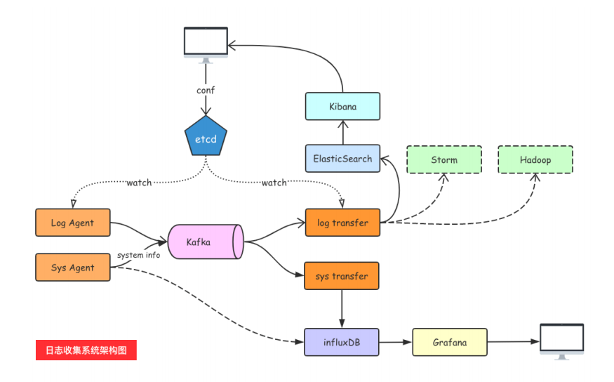

# day11课上笔记

# 今日内容

## 依赖管理go module

如果是使用的Go1.11和Go1.12的版本，需要手动开启go module支持：


### goproxy

设置代理，下载墙外的库更快、

```bash
export GOPROXY=https://goproxy.cn    Mac

SET GOPROXY=https://goproxy.cn       Windows
```

### go.mod文件

记录了当前项目依赖的第三方包信息和版本信息

第三方的依赖包都下载到了 `GOPATH/pkg/mod`目录下。

### go.sum文件

详细包名和版本信息

### 常用的命令

```bash
go mod init [包名] // 初始化项目
go mod tidy // 检查代码里的依赖去更新go.mod文件中的依赖
go get
go mod download
```

## Context

非常重要！

如何优雅的控制子goroutine退出？

#### 两个默认值

```go
context.Background()
context.TODO()
```

#### 四个方法

```go
context.WithCancel(context.Background())
context.WithDeadline(context.Background(), time.Time)
context.WithTimeout(context.Background(), time.Duration)
context.WithValue(context.BackGround(), key, value)
```


## 服务端Agent开发

zookkeeper、kafka部署文档：[https://docs.qq.com/doc/DTmdldEJJVGtTRkFi](https://docs.qq.com/doc/DTmdldEJJVGtTRkFi)


#### Kafka


1. Kafka集群的架构
   1. broker
   2. topic
   3. partition:分区，把同一个topic分成不同的分区，提高负载
      1. leader:分区的主节点（老大）
      2. follower：分区的从节点（小弟）
   4. Consumer Group

2. 生产者往Kafka发送数据的流程（6步）

   

   

3. Kafka选择分区的模式（3种）

   1. 指定往哪个分区写
   2. 指定key，kafka根据key做hash然后决定写哪个分区
   3. 轮询方式

4. 生产者往kafka发送数据的模式（3种）

   1. `0`：把数据发给leader就成功，效率最高、安全性最低。
   2. `1`: 把数据发送给leader，等待leader回ACK
   3. `all`:把数据发给leader,确保follower从leader拉取数据回复ack给leader，leader再回复ACK；安全性最高

5. 分区存储文件的原理
6. 为什么kafka快？
7. 消费者组消费数据的原理


### 项目架构设计




#### LogAgent的工作流程：

1. 读日志 --`tailf`第三方库

   ```go
   func main() {
   	fileName := "./my.log"
   	config := tail.Config{
   		ReOpen:    true,                                 // 重新打开
   		Follow:    true,                                 // 是否跟随
   		Location:  &tail.SeekInfo{Offset: 0, Whence: 2}, // 从文件的哪个地方开始读
   		MustExist: false,                                // 文件不存在不报错
   		Poll:      true,
   	}
   	tails, err := tail.TailFile(fileName, config)
   	if err != nil {
   		fmt.Println("tail file failed, err:", err)
   		return
   	}
   	var (
   		line *tail.Line
   		ok   bool
   	)
   	for {
   		line, ok = <-tails.Lines
   		if !ok {
   			fmt.Printf("tail file close reopen, filename:%s\n", tails.Filename)
   			time.Sleep(time.Second)
   			continue
   		}
   		fmt.Println("line:", line.Text)
   	}
   }
   ```

   

2. 往kafka写日志 --`sarama`第三方库

   ```go
   // 基于sarama第三⽅库开发的kafka client
   func main() {
   	config := sarama.NewConfig()
   	// tailf包使⽤
   	config.Producer.RequiredAcks = sarama.WaitForAll // 发送完数据需要leader和follow都确认
   	config.Producer.Partitioner = sarama.NewRandomPartitioner // 新选出⼀个 partition
   	config.Producer.Return.Successes = true // 成功交付的消息将在success channel返回
   
   
   	// 构造⼀个消息
   	msg := &sarama.ProducerMessage{}
   	msg.Topic = "web_log"
   	msg.Value = sarama.StringEncoder("this is a test log")
   
   	// 连接kafka
   	client, err := sarama.NewSyncProducer([]string{"127.0.0.1:9092"}, config)
   	if err != nil {
   		fmt.Println("producer closed, err:", err)
   		return
   	}
   	fmt.Println("连接kafka成功！")
   	defer client.Close()
   	// 发送消息
   	pid, offset, err := client.SendMessage(msg)
   	fmt.Println("xxx")
   	if err != nil {
   		fmt.Println("send msg failed, err:", err)
   		return
   	}
   	fmt.Printf("pid:%v offset:%v\n", pid, offset)
   	fmt.Println("发送成功！")
   }
   ```

### kafka和zookeeper

### tail介绍

### gopkg.in/ini.v1


kafka终端读取数据：

```bash
bin\windows\kafka-console-consumer.bat --bootstrap-server=127.0.0.1:9092 --topic=web_log --from-beginning
```


## 补充

Goland开启go module和设置GOPROXY代理


# 本周作业

把logagent自己实现一遍

