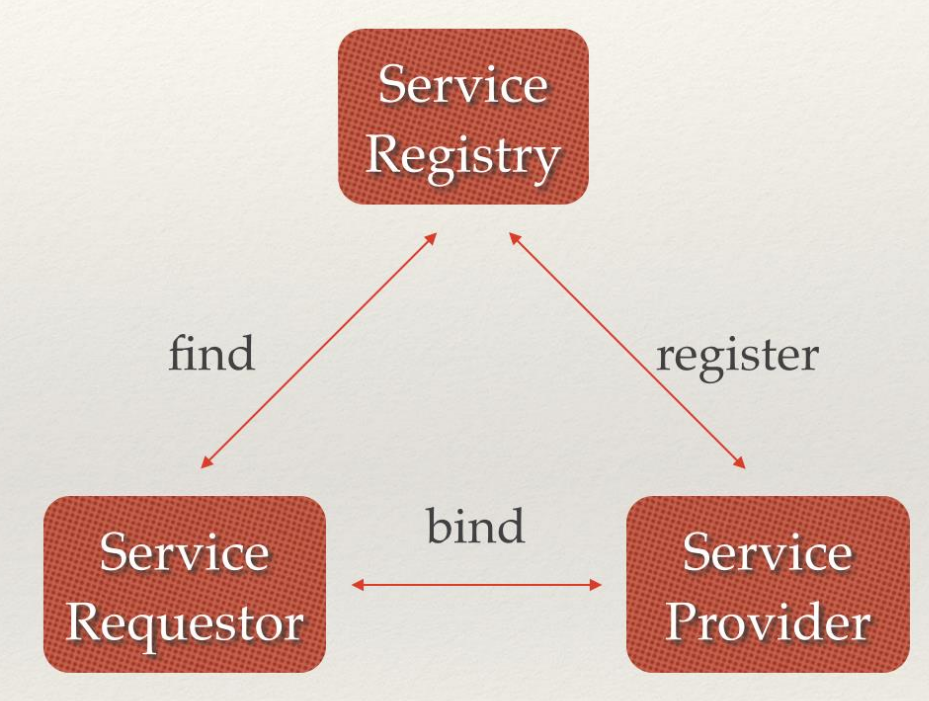
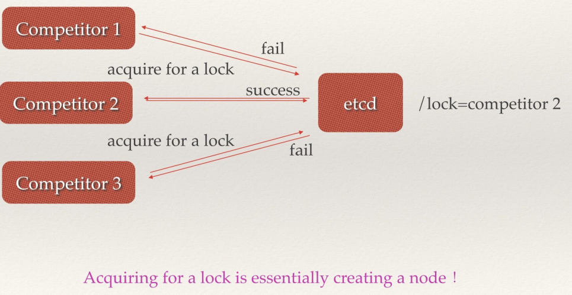
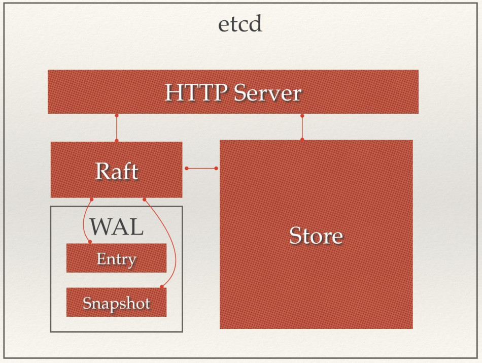

<!--
 * @Description: 
 * @Author: neozhang
 * @Date: 2022-04-05 13:50:04
 * @LastEditors: neozhang
 * @LastEditTime: 2022-04-05 14:03:34
-->
# etcd  

## etcd介绍  

etcd是使用Go语言开发的一个开源的、高可用的分布式key-value存储系统，可以用于配置共享和服务的注册和发现。  

类似项目有zookeeper和consul。  

etcd具有以下特点：  

- 完全复制：集群中的每个节点都可以使用完整的存档  
- 高可用性：Etcd可用于避免硬件的单点故障或网络问题  
- 一致性：每次读取都会返回跨多主机的最新写入  
- 简单：包括一个定义良好、面向用户的API（gRPC）  
- 安全：实现了带有可选的客户端证书身份验证的自动化TLS  
- 快速：每秒10000次写入的基准速度  
- 可靠：使用Raft算法实现了强一致、高可用的服务存储目录  

## etcd应用场景  

### 服务发现  

服务发现要解决的也是分布式系统中最常见的问题之一，即在同一个分布式集群中的进程或服务，要如何才能找到对方并建立连接。本质上来说，服务发现就是想要了解集群中是否有进程在监听 udp 或 tcp端口，并且通过名字就可以查找和连接。  

  

### 配置中心  

将一些配置信息放到 etcd 上进行集中管理。  

这类场景的使用方式通常是这样：应用在启动的时候主动从 etcd 获取一次配置信息，同时，在 etcd 节点上注册一个 Watcher 并等待，以后每次配置有更新的时候，etcd 都会实时通知订阅者，以此达到获取最新配置信息的目的。  

### 分布式锁  

因为 etcd 使用 Raft 算法保持了数据的强一致性，某次操作存储到集群中的值必然是全局一致的，所以很容易实现分布式锁。锁服务有两种使用方式，一是保持独占，二是控制时序。  

- 保持独占即所有获取锁的用户最终只有一个可以得到。etcd 为此提供了一套实现分布式锁原子操作 CAS（ CompareAndSwap ）的 API。通过设置 prevExist 值，可以保证在多个节点同时去创建某个目录时，只有一个成功。而创建成功的用户就可以认为是获得了锁。  

- 控制时序，即所有想要获得锁的用户都会被安排执行，但是获得锁的顺序也是全局唯一的，同时决定了执行顺序。etcd 为此也提供了一套 API（自动创建有序键），对一个目录建值时指定为 POST动作，这样etcd 会自动在目录下生成一个当前最大的值为键，存储这个新的值（客户端编号）。同时还可以使用 API 按顺序列出所有当前目录下的键值。此时这些键的值就是客户端的时序，而这些键中存储的值可以是代表客户端的编号。  

  

## 为什么用 etcd 而不用ZooKeeper？  

etcd 实现的这些功能，ZooKeeper都能实现。那么为什么要用 etcd 而非直接使用ZooKeeper呢？  

相较之下，ZooKeeper有如下缺点：  

1.复杂。ZooKeeper的部署维护复杂，管理员需要掌握一系列的知识和技能；而 Paxos 强一致性算法也是素来以复杂难懂而闻名于世；另外，ZooKeeper的使用也比较复杂，需要安装客户端，官方只提供了 Java 和 C 两种语言的接口。  

2.Java 编写。这里不是对 Java 有偏见，而是 Java 本身就偏向于重型应用，它会引入大量的依赖。而
运维人员则普遍希望保持强一致、高可用的机器集群尽可能简单，维护起来也不易出错。  

3.发展缓慢。Apache 基金会项目特有的“Apache Way”在开源界饱受争议，其中一大原因就是由于基金会庞大的结构以及松散的管理导致项目发展缓慢。  

而 etcd 作为一个后起之秀，其优点也很明显。  

1.简单。使用 Go 语言编写部署简单；使用 HTTP 作为接口使用简单；使用 Raft 算法保证强一致性让用户易于理解。  

2.数据持久化。etcd 默认数据一更新就进行持久化。  
3.安全。etcd 支持 SSL 客户端安全认证。  

最后，etcd 作为一个年轻的项目，真正告诉迭代和开发中，这既是一个优点，也是一个缺点。优点是它的未来具有无限的可能性，缺点是无法得到大项目长时间使用的检验。然而，目前 CoreOS、Kubernetes 和CloudFoundry 等知名项目均在生产环境中使用了 etcd，所以总的来说，etcd 值得你去尝试。  

## etcd架构  

  

从 etcd 的架构图中我们可以看到，etcd 主要分为四个部分。  

- HTTP Server： 用于处理用户发送的 API 请求以及其它 etcd 节点的同步与心跳信息请求。  
- Store：用于处理 etcd 支持的各类功能的事务，包括数据索引、节点状态变更、监控与反馈、事件处理与执行等等，是 etcd 对用户提供的大多数 API 功能的具体实现。  
- Raft：Raft 强一致性算法的具体实现，是 etcd 的核心。  
- WAL：Write Ahead Log（预写式日志），是 etcd 的数据存储方式。除了在内存中存有所有数据的状态以及节点的索引以外，etcd 就通过 WAL 进行持久化存储。WAL 中，所有的数据提交前都会事先记录日志。Snapshot 是为了防止数据过多而进行的状态快照；Entry 表示存储的具体日志内容。  

## etcd集群  

etcd 作为一个高可用键值存储系统，天生就是为集群化而设计的。由于 Raft 算法在做决策时需要多数节点的投票，所以 etcd 一般部署集群推荐奇数个节点，推荐的数量为 3、5 或者 7 个节点构成一个集群。  

### 搭建一个3节点集群示例：  

在每个etcd节点指定集群成员，为了区分不同的集群最好同时配置一个独一无二的token。  

下面是提前定义好的集群信息，其中 n1 、 n2 和 n3 表示3个不同的etcd节点。  

```
TOKEN=token-01
CLUSTER_STATE=new
CLUSTER=n1=http://10.240.0.17:2380,n2=http://10.240.0.18:2380,n3=http://10.240.0
.19:2380
```

在 n1 这台机器上执行以下命令来启动etcd：  

```
etcd --data-dir=data.etcd --name n1 \
--initial-advertise-peer-urls http://10.240.0.17:2380 --listen-peer-urls
http://10.240.0.17:2380 \
--advertise-client-urls http://10.240.0.17:2379 --listen-client-urls
http://10.240.0.17:2379 \
--initial-cluster ${CLUSTER} \
--initial-cluster-state ${CLUSTER_STATE} --initial-cluster-token ${TOKEN}
```

在 n2 这台机器上执行以下命令启动etcd：  

```
etcd --data-dir=data.etcd --name n2 \
--initial-advertise-peer-urls http://10.240.0.18:2380 --listen-peer-urls
http://10.240.0.18:2380 \
--advertise-client-urls http://10.240.0.18:2379 --listen-client-urls
http://10.240.0.18:2379 \
--initial-cluster ${CLUSTER} \
--initial-cluster-state ${CLUSTER_STATE} --initial-cluster-token ${TOKEN}
```

在 n3 这台机器上执行以下命令启动etcd：  

```
etcd --data-dir=data.etcd --name n3 \
--initial-advertise-peer-urls http://10.240.0.19:2380 --listen-peer-urls
http://10.240.0.19:2380 \
--advertise-client-urls http://10.240.0.19:2379 --listen-client-urls
http://10.240.0.19:2379 \
--initial-cluster ${CLUSTER} \
--initial-cluster-state ${CLUSTER_STATE} --initial-cluster-token ${TOKEN}
```

etcd 官网提供了一个可以公网访问的 etcd 存储地址。你可以通过如下命令得到 etcd 服务的目录，并把
它作为 -discovery 参数使用。  

```
curl https://discovery.etcd.io/new?size=3
https://discovery.etcd.io/a81b5818e67a6ea83e9d4daea5ecbc92
# grab this token
TOKEN=token-01
CLUSTER_STATE=new
DISCOVERY=https://discovery.etcd.io/a81b5818e67a6ea83e9d4daea5ecbc92
etcd --data-dir=data.etcd --name n1 \
--initial-advertise-peer-urls http://10.240.0.17:2380 --listen-peer-urls
http://10.240.0.17:2380 \
--advertise-client-urls http://10.240.0.17:2379 --listen-client-urls
http://10.240.0.17:2379 \
--discovery ${DISCOVERY} \
--initial-cluster-state ${CLUSTER_STATE} --initial-cluster-token ${TOKEN}
etcd --data-dir=data.etcd --name n2 \
--initial-advertise-peer-urls http://10.240.0.18:2380 --listen-peer-urls
http://10.240.0.18:2380 \
--advertise-client-urls http://10.240.0.18:2379 --listen-client-urls
http://10.240.0.18:2379 \
--discovery ${DISCOVERY} \--initial-cluster-state ${CLUSTER_STATE} --initial-cluster-token ${TOKEN}
etcd --data-dir=data.etcd --name n3 \
--initial-advertise-peer-urls http://10.240.0.19:2380 --listen-peer-urls
http://10.240.0.19:2380 \
--advertise-client-urls http://10.240.0.19:2379 --listen-client-urls
http:/10.240.0.19:2379 \
--discovery ${DISCOVERY} \
--initial-cluster-state ${CLUSTER_STATE} --initial-cluster-token ${TOKEN}
```

到此etcd集群就搭建起来了，可以使用 etcdctl 来连接etcd。  

```
export ETCDCTL_API=3
HOST_1=10.240.0.17
HOST_2=10.240.0.18
HOST_3=10.240.0.19
ENDPOINTS=$HOST_1:2379,$HOST_2:2379,$HOST_3:2379
etcdctl --endpoints=$ENDPOINTS member list
```

## Go语言操作etcd  

这里使用官方的etcd/clientv3包来连接etcd并进行相关操作。  

### 安装  

```
go get go.etcd.io/etcd/clientv3
```

### put和get操作  

put 命令用来设置键值对数据， get 命令用来根据key获取值。  

[demo](../day12/etcd_put/main.go)


### watch操作  

watch 用来获取未来更改的通知。  

[](../day12/etcd_watch/main.go)  

将上面的代码保存编译执行，此时程序就会等待etcd中 q1mi 这个key的变化。  

例如：我们打开终端执行以下命令修改、删除、设置 q1mi 这个key。  

```
etcd> etcdctl.exe --endpoints=http://127.0.0.1:2379 put q1mi "dsb2"
OK
etcd> etcdctl.exe --endpoints=http://127.0.0.1:2379 del q1mi
1
etcd> etcdctl.exe --endpoints=http://127.0.0.1:2379 put q1mi "dsb3"
OK
```

上面的程序都能收到如下通知。  

```
watch>watch.exe
connect to etcd success
Type: PUT Key:q1mi Value:dsb2
Type: DELETE Key:q1mi Value:
Type: PUT Key:q1mi Value:dsb3
```

## 其他操作  

其他操作请查看etcd/clientv3官方文档。  

参考链接：<https://etcd.io/docs/v3.3.12/demo/
https://www.infoq.cn/article/etcd-interpretation-application-scenario-implement-principle/>