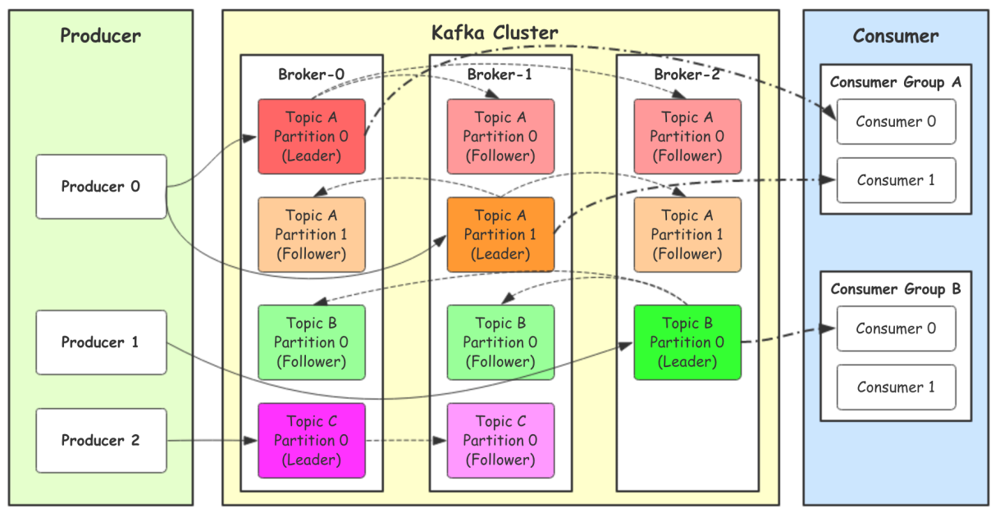
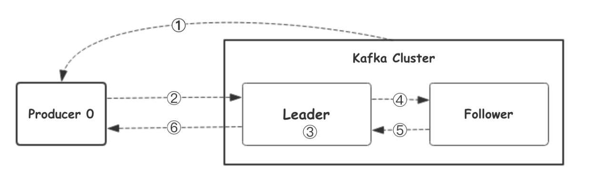
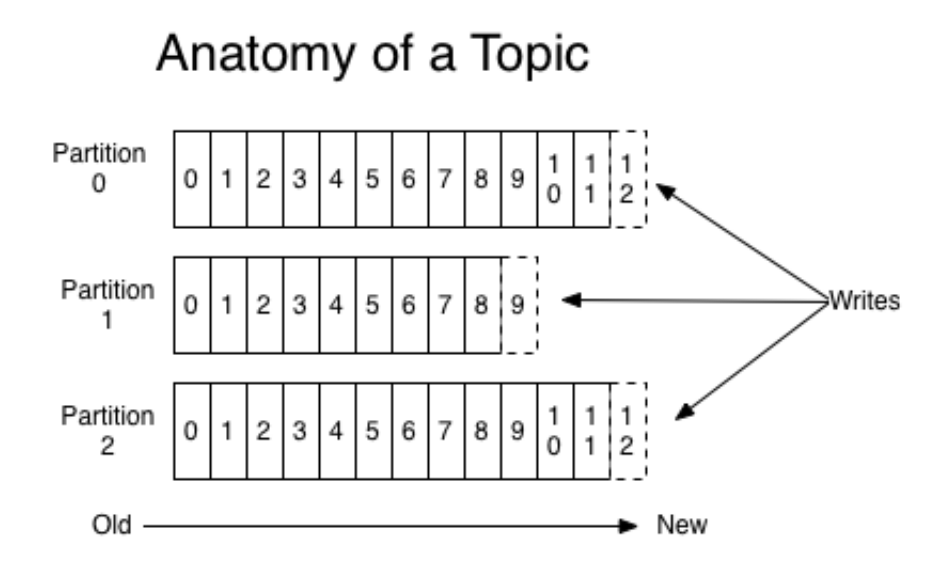
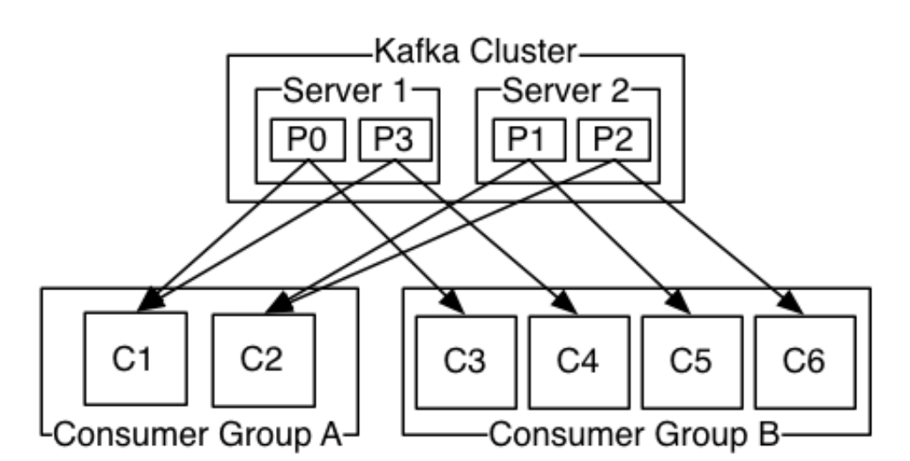

<!--
 * @Description: 
 * @Author: neozhang
 * @Date: 2022-04-04 23:03:05
 * @LastEditors: neozhang
 * @LastEditTime: 2022-04-04 23:14:22
-->

# Kafka  

Apache Kafka由著名职业社交公司LinkedIn开发，最初是被设计用来解决LinkedIn公司内部海量日志传输等问题。Kafka使用Scala语⾔编写，于2011年年开源并进⼊入Apache孵化器，2012年年10⽉月正式毕业，现在为Apache顶级项目。  

Kafka是一个分布式数据流平台，可以运行在单台服务器上，也可以在多台服务器上部署形成集群。它提供了发布和订阅功能，使⽤者可以发送数据到Kafka中，也可以从Kafka中读取数据（以便便进行后续的处理）。Kafka具有⾼吞吐、低延迟、高容错等特点。  

## 架构介绍  

  

- Producer：Producer即生产者，消息的产生者，是消息的入⼝。  
- kafka cluster：kafka集群，一台或多台服务器组成  
Broker：Broker是指部署了Kafka实例的服务器节点。每个服务器上有一个或多个kafka的实例，我们姑且认为每个broker对应一台服务器。每个kafka集群内的broker都有一个不重复的编号，如图中的broker-0、broker-1等……

Topic：消息的主题，可以理解为消息的分类，kafka的数据就保存在topic。在每个broker上都可以创建多个topic。实际应⽤用中通常是一个业务线建一个topic。  

Partition：Topic的分区，每个topic可以有多个分区，分区的作用是做负载，提高kafka的吞吐量。同一个topic在不同的分区的数据是不重复的，partition的表现形式就是⼀个一个的文件夹。  

Replication:每一个分区都有多个副本，副本的作用是做备胎。当主分区（Leader）故障的时候会选择一个备胎（Follower）上位，成为Leader。在kafka中默认副本的最大数量是10个，且副本的数量不能大于Broker的数量量，follower和leader绝对是在不同的机器，同一机器对同⼀个分区也只可能存放一个副本（包括⾃⼰）。  

- Consumer：消费者，即消息的消费方，是消息的出⼝。  
Consumer Group：我们可以将多个消费组成一个消费者组，在kafka的设计中同一个分区的数据只能被消费者组中的某一个消费者消费。同一个消费者组的消费者可以消费同一个topic的不同分区的数据，这也是为了了提高kafka的吞吐量。  

## ⼯作流程  

我们看上面的架构图中，producer就是生产者，是数据的入口。Producer在写入数据的时候会把数据写入到leader中，不会直接将数据写入follower！那leader怎么找呢？写入的流程又是什么样的呢？我们看下图：  

  

1. ⽣产者从Kafka集群获取分区leader信息  
2. ⽣产者将消息发送给leader  
3. leader将消息写入本地磁盘  
4. follower从leader拉取消息数据  
5. follower将消息写入本地磁盘后向leader发送ACK  
6. leader收到所有的follower的ACK之后向生产者发送ACK  

## 选择partition的原则  

那在kafka中，如果某个topic有多个partition，producer又怎么知道该将数据发往哪个partition呢？  
kafka中有几个原则：  

1.partition在写入的时候可以指定需要写入的partition，如果有指定，则写入对应的partition。  
2.如果没有指定partition，但是设置了数据的key，则会根据key的值hash出一个partition。  
3.如果既没指定partition，又没有设置key，则会采用轮询⽅式，即每次取一小段时间的数据写入某个partition，下一小段的时间写入下一个partition。  

## ACK应答机制  

producer在向kafka写入消息的时候，可以设置参数来确定是否确认kafka接收到数据，这个参数可设置
的值为0、1、all。  

- 0代表producer往集群发送数据不不需要等到集群的返回，不不确保消息发送成功。安全性最低但是效
率最⾼高。  
- 1代表producer往集群发送数据只要leader应答就可以发送下一条，只确保leader发送成功。  
- all代表producer往集群发送数据需要所有的follower都完成从leader的同步才会发送下一条，确保
leader发送成功和所有的副本都完成备份。安全性最高，但是效率最低。  

最后要注意的是，如果往不存在的topic写数据，kafka会自动创建topic，partition和replication的数量默认配置都是1。  

## Topic和数据日志  

topic是同一类别的消息记录（record）的集合。在Kafka中，一个主题通常有多个订阅者。对于每个主题，Kafka集群维护了了一个分区数据日志文件结构如下：  

  

每个partition都是一个有序并且不可变的消息记录集合。当新的数据写入时，就被追加到partition的末尾。在每个partition中，每条消息都会被分配一个顺序的唯一标识，这个标识被称为offset，即偏移量。  
注意，Kafka只保证在同⼀个partition内部消息是有序的，在不同partition之间，并不能保证消息有序。  

Kafka可以配置一个保留期限，用来标识日志会在Kafka集群内保留多长时间。Kafka集群会保留在保留期限内所有被发布的消息，不管这些消息是否被消费过。⽐如保留期限设置为两天，那么数据被发布到Kafka集群的两天以内，所有的这些数据都可以被消费。当超过两天，这些数据将会被清空，以便为后续的数据腾出空间。由于Kafka会将数据进⾏行持久化存储（即写⼊入到硬盘上），所以保留的数据大⼩可以设置为⼀个⽐较大的值。  

## Partition结构  

Partition在服务器上的表现形式就是一个一个的文件夹，每个partition的⽂件夹下面会有多组segment文件，每组segment⽂件又包含 .index 文件、 .log ⽂文件、 .timeindex 文件三个文件，其中 .log 文件就是实际存储message的地方，⽽ .index 和 .timeindex ⽂件为索引文件，⽤于检索消息。  

### 消费数据  

多个消费者实例可以组成一个消费者组，并⽤一个标签来标识这个消费者组。一个消费者组中的不同消费者实例可以运行在不同的进程甚至不同的服务器上。  

如果所有的消费者实例都在同一个消费者组中，那么消息记录会被很好的均衡的发送到每个消费者实例。  

如果所有的消费者实例都在不同的消费者组，那么每⼀条消息记录会被广播到每一个消费者实例。  

  

举个例子，如上图所示一个两个节点的Kafka集群上拥有一个四个partition（P0-P3）的topic。有两个
消费者组都在消费这个topic中的数据，消费者组A有两个消费者实例，消费者组B有四个消费者实例。
从图中我们可以看到，在同一个消费者组中，每个消费者实例可以消费多个分区，但是每个分区最多只能被消费者组中的一个实例例消费。也就是说，如果有⼀个4个分区的主题，那么消费者组中最多只能有4个消费者实例去消费，多出来的都不会被分配到分区。其实这也很好理理解，如果允许两个消费者实例例同时消费同⼀个分区，那么就无法记录这个分区被这个消费者组消费的offset了了。如果在消费者组中动态的上线或下线消费者，那么Kafka集群会⾃动调整分区与消费者实例间的对应关系。  

## 使用场景  

上⾯介绍了了Kafka的⼀些基本概念和原理，那么Kafka可以做什么呢？⽬前主流使用场景基本如下：  

### 消息队列（MQ）  

在系统架构设计中，经常会使用消息队列（Message Queue）——MQ。
MQ是一种跨进程的通信机制，⽤于上下游的消息传递，使用MQ可以使上下游解耦，消息发送上游只需要依赖MQ，逻辑上和物理上都不需要依赖其他下游服务。MQ的常⻅使⽤场景如流量削峰、数据驱动的任务依赖等等。在MQ领域，除了Kafka外还有传统的消息队列如ActiveMQ和RabbitMQ等。  

### 追踪⽹站活动  

Kafka最出就是被设计用来进行网站活动（比如PV、UV、搜索记录等）的追踪。可以将不同的活动放⼊不同的主题，供后续的实时计算、实时监控等程序使⽤用，也可以将数据导入到数据仓库中进行后续的离线处理和⽣成报表等。  

### Metrics  

Kafka经常被⽤来传输监控数据。主要用来聚合分布式应用程序的统计数据，将数据集中后进行统一的分析和展示等。

### 日志聚合  

很多人使用Kafka作为日志聚合的解决方案。⽇志聚合通常指将不同服务器上的⽇志收集起来并放入⼀个日志中心，⽐如一台文件服务器或者HDFS中的⼀个目录，供后续进行分析处理。相⽐于Flume和Scribe等⽇志聚合工具，Kafka具有更出色的性能。  

下载地址：http://kafka.apache.org/downloads  