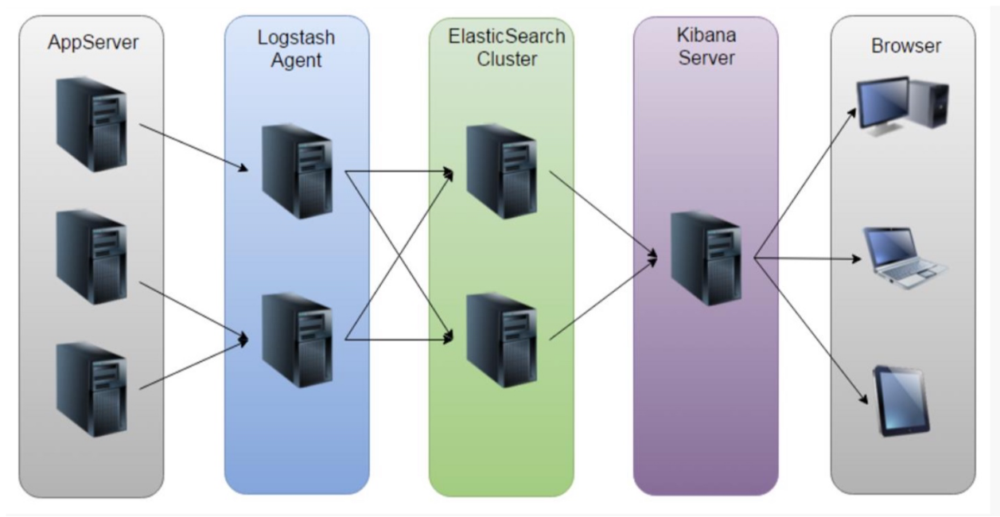
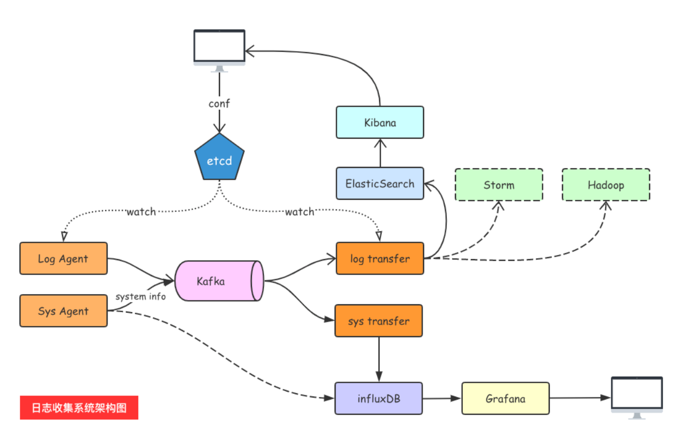

<!--
 * @Description:
 * @Author: neozhang
 * @Date: 2022-04-04 19:15:53
 * @LastEditors: neozhang
 * @LastEditTime: 2022-04-04 23:34:12
-->
# 日志收集系统  

日志收集项目架构设计及Kafka介绍  

## 项⽬背景  

每个业务系统都有日志，当系统出现问题时，需要通过日志信息来定位和解决问题。 当系统机器器⽐比较少时，登陆到服务器上查看即可满足 当系统机器器规模巨大，登陆到机器器上查看⼏乎不现实（分布式的系统，一个系统部署在⼗⼏台机器上）。  

## 解决⽅案  

把机器上的⽇志实时收集，统一存储到中⼼系统。再对这些⽇志建立索引，通过搜索即可快速找到对应的日志记录。 通过提供一个界⾯友好的web⻚⾯实现⽇志展示与检索。  

## 面临的问题  

实时日志量⾮常大，每天处理⼏⼗亿条。⽇志准实时收集，延迟控制在分钟级别。系统的架构设计能够支持水平扩展。  

## 业界⽅案  

### ELK  

  

### ELK⽅案的问题  

- 运维成本高，每增加一个⽇志收集项，都需要⼿动修改配置。  
- 监控缺失，⽆法准确获取logstash的状态。  
- 无法做到定制化开发与维护。  

## 日志收集系统架构设计  

### 架构设计  

  

### 组件介绍  

- LogAgent：⽇志收集客户端，⽤来收集服务器上的日志。  
- Kafka：高吞吐量的分布式队列（Linkin开发，apache顶级开源项目）  
- ElasticSearch：开源的搜索引擎，提供基于HTTP RESTful的web接口。  
- Kibaa：开源的ES数据分析和可视化⼯工具。  
- Hadoop：分布式计算框架，能够对⼤量数据进行分布式处理的平台。  
- Storm：⼀个免费并开源的分布式实时计算系统。  

### 将学到的技能  

- 服务端agent开发  
- 后端服务组件开发  
- Kafka和zookeeper的使⽤  
- ES和Kibana的使⽤  
- etcd的使⽤  

## 消息队列的通信模型  

### 点对点模式(queue)  

消息生产者⽣生产消息发送到queue中，然后消费者从queue中取出并且消费消息。 一条消息被消费以后，queue中就没有了，不存在重复消费。  

### 发布/订阅(topic)  

消息生产者（发布）将消息发布到topic中，同时有多个消费者（订阅）消费该消息。和点对点方式不同，发布到topic的消息会被所有订阅者消费（类似于关注了了微信公众号的⼈人都能收到推送的⽂文章）。  

补充：发布订阅模式下，当发布者消息量很大时，显然单个订阅者的处理理能力是不⾜的。实际上现实场景中是多个订阅者节点组成一个订阅组负载均衡消费topic消息即分组订阅，这样订阅者很容易实现消费能力线性扩展。可以看成是⼀个topic下有多个Queue，每个Queue是点对点的方式，Queue之间是发布订阅⽅式。  

## log agent开发  

下载安装  

```
go get github.com/Shopify/sarama
```

sarama v1.20之后的版本加⼊了 zstd 压缩算法，需要⽤到cgo，在Windows平台编译时会提示类似如下错误：  

```
# github.com/DataDog/zstd
exec: "gcc":executable file not found in %PATH%
```

所以在Windows平台请使用v1.19版本的sarama。  
